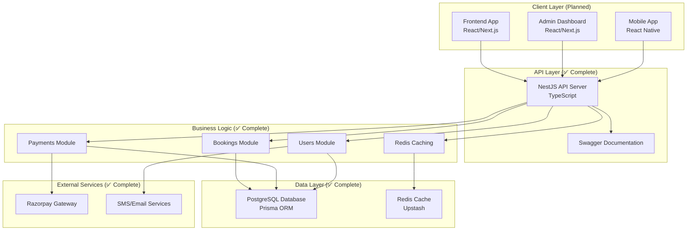

# Hall Booking System - White Label Platform

**Enterprise-grade white-label booking system for individual venues with zero double-bookings and flexible payment options**

Designed as a **white-label solution** where each venue gets their own branded booking interface. Built for Parbhani hall MVP, architected to scale as SaaS serving 100+ independent venue instances.

## 🎯 Core Concept

### White-Label Architecture
- **One Venue Per Instance**: Each deployment serves a single venue
- **Custom Branding**: Venue name, colors, and contact info
- **Multi-Day Booking**: Customers select one or multiple full days
- **Simple Flow**: Calendar → Event Details → Login → Payment → Confirmation

### NOT a Marketplace
This is explicitly **NOT** a marketplace platform. Each venue operates independently with their own:
- Branded interface
- Booking calendar  
- Payment settings
- Customer base

## 🏗️ System Architecture

This system solves the **double-booking problem** through database-level exclusion constraints while providing a modern, scalable API for hall bookings, user management, and **revolutionary flexible payment processing** that serves all types of venues from cash-only to fully digital.



## 🚀 Current Implementation Status

| Component | Status | Description |
|-----------|--------|-------------|
| **Backend API** | ✅ Complete | NestJS + TypeScript, production-ready |
| **Database Schema** | ✅ Complete | PostgreSQL with exclusion constraints |
| **Payment System** | ✅ Complete | Flexible payment profiles (5 types) |
| **User Auth** | ✅ Complete | Phone-based OTP authentication |
| **Frontend - Landing** | ✅ Complete | Venue-focused homepage |
| **Frontend - Calendar** | ✅ Complete | Multi-day date selection |
| **Frontend - Event Details** | ✅ Complete | Event info collection |
| **Frontend - Auth Flow** | ✅ Complete | OTP-based login |
| **Frontend - Payment** | 🔄 In Progress | Payment method selection |
| **Frontend - Confirmation** | ⏳ Planned | Booking review screen |
| **Admin Dashboard** | ⏳ Planned | Venue management |
| **Mobile App** | ⏳ Future | React Native |

## 💻 Tech Stack

### Backend (Production Ready)
- **Framework**: [NestJS](https://nestjs.com/) with TypeScript
- **Database**: PostgreSQL with [Prisma ORM](https://prisma.io/)
- **Caching**: Redis ([Upstash](https://upstash.com/))
- **Payments**: [Razorpay](https://razorpay.com/) integration
- **API Docs**: Swagger/OpenAPI
- **Validation**: class-validator + class-transformer
- **Logging**: Winston with structured logging

### Frontend (In Progress - 70% Complete)
- **Framework**: Next.js 14 (App Router)
- **Styling**: TailwindCSS v4 with modern purple/indigo palette
- **UI Components**: ShadCN UI
- **State Management**: Zustand with localStorage persistence
- **Forms**: React Hook Form + Zod validation
- **Date Selection**: react-day-picker (multi-date support)
- **Notifications**: Sonner (toast notifications)

### DevOps & Infrastructure
- **Database Hosting**: Supabase (PostgreSQL)
- **Cache Hosting**: Upstash (Redis)
- **Deployment**: Railway / Vercel
- **Monitoring**: Built-in health checks

## 💳 Revolutionary Payment System

### Market Coverage Strategy

Traditional booking platforms force venues to accept online payments only, excluding 70% of Indian venues that prefer cash operations. **Our system serves EVERYONE**.

### Payment Profiles

| Profile | Commission | Description | Target Venues |
|---------|------------|-------------|---------------|
| **Cash Only** | 5% | Zero tech barrier, manual confirmation | Traditional halls, family businesses |
| **Cash + Deposit** | 7% | Small online deposit + cash balance | Progressive traditional venues |
| **Hybrid Flexible** | 8% | Customer chooses payment method | Modern venues serving all customers |
| **Full Online** | 10% | All payments online, instant confirmation | Tech-savvy venues |
| **Marketplace** | 15% | Platform handles everything | Premium full-service venues |

## 📁 Project Structure

```
hall-booking-app/
├── backend/                       # NestJS API Server
│   ├── src/
│   │   ├── bookings/             # ✅ Booking management
│   │   ├── payments/             # ✅ Payment processing
│   │   ├── users/                # ✅ User & auth management
│   │   ├── auth/                 # ✅ OTP authentication  
│   │   ├── prisma/               # ✅ Database access
│   │   ├── redis/                # ✅ Caching layer
│   │   └── common/               # ✅ Shared utilities
│   └── prisma/
│       ├── schema.prisma         # Database schema
│       └── migrations/           # DB migrations
├── frontend/                      # Next.js 14 Customer App
│   ├── src/
│   │   ├── app/
│   │   │   ├── page.tsx          # ✅ Landing page
│   │   │   ├── booking/          # ✅ Multi-day calendar
│   │   │   ├── event-details/    # ✅ Event info form
│   │   │   ├── auth/             # ✅ OTP login
│   │   │   ├── payment/          # 🔄 Payment selection
│   │   │   ├── confirmation/     # ⏳ Booking review
│   │   │   └── success/          # ⏳ Confirmation screen
│   │   ├── components/
│   │   │   ├── ui/               # ✅ ShadCN components
│   │   │   ├── booking/          # ✅ Booking components
│   │   │   ├── auth/             # ✅ Auth components
│   │   │   └── navigation.tsx    # ✅ Header
│   │   ├── stores/
│   │   │   ├── booking-store.ts  # ✅ Booking state
│   │   │   └── auth-store.ts     # ✅ Auth state
│   │   ├── services/             # ✅ API services
│   │   └── types/                # ✅ TypeScript types
│   └── ui-tasks.json             # ✅ Development tracker
└── README.md                      # This file
```

## 🚀 Quick Start

### Backend Setup

```bash
# 1. Navigate to backend
cd backend

# 2. Install dependencies
npm install

# 3. Setup environment
cp .env.example .env
# Edit .env with your configuration

# 4. Setup database
npx prisma generate
npx prisma migrate deploy

# 5. Start server
npm run start:dev

# Backend runs at http://localhost:3000
# API docs at http://localhost:3000/api/v1/docs
```

### Frontend Setup

```bash
# 1. Navigate to frontend
cd frontend

# 2. Install dependencies  
npm install

# 3. Setup environment
cp .env.example .env.local
# Configure API_URL and other settings

# 4. Start development server
npm run dev

# Frontend runs at http://localhost:3001
```

## 🔗 API Overview

### Core Endpoints

| Method | Endpoint | Description | Status |
|--------|----------|-------------|--------|
| `GET` | `/health` | System health check | ✅ |
| `POST` | `/api/v1/bookings` | Create new booking | ✅ |
| `GET` | `/api/v1/bookings/:id` | Get booking details | ✅ |
| `POST` | `/api/v1/users` | Create user | ✅ |
| `GET` | `/api/v1/users/:id` | Get user details | ✅ |

### Payment System Endpoints

| Method | Endpoint | Description | Status |
|--------|----------|-------------|--------|
| `GET` | `/api/v1/payments/bookings/:id/options` | Get payment options | ✅ |
| `POST` | `/api/v1/payments/bookings/:id/select-method` | Select payment method | ✅ |
| `POST` | `/api/v1/payments/bookings/:id/payment-link` | Create Razorpay link | ✅ |
| `POST` | `/api/v1/payments/bookings/:id/cash-payment` | Record cash payment | ✅ |
| `POST` | `/api/v1/payments/venues/:id/onboarding` | Setup payment profile | ✅ |

### API Documentation

When running the development server, visit:
- **Swagger UI**: http://localhost:3000/api/v1/docs
- **API Base URL**: http://localhost:3000/api/v1/

## 🗄️ Database Schema

### Core Tables

- **tenants**: Multi-tenant support for SaaS scalability
- **venues**: Hall/venue configuration with flexible payment profiles
- **users**: Customer and admin management with role-based access
- **bookings**: Core booking data with payment method integration
- **payments**: Online payment transactions via Razorpay
- **cash_payments**: Offline payment tracking and verification
- **commission_records**: Automated platform fee management
- **customer_payment_preferences**: Payment behavior analytics
- **venue_onboarding_responses**: Smart payment profile recommendations

### Key Features

- **Zero Double-Bookings**: PostgreSQL exclusion constraints prevent overlapping bookings
- **Multi-Tenant Architecture**: Row-level security for SaaS scalability
- **Flexible Payment Schema**: Supports all payment methods from cash-only to full online
- **Commission Tracking**: Automated platform fee calculation and collection

## 🧪 Testing

```bash
# Unit tests
npm run test

# Test coverage
npm run test:cov

# E2E tests
npm run test:e2e

# Watch mode for development
npm run test:watch

# Debug tests
npm run test:debug
```

## 📊 Performance Benchmarks

| Operation | Target Response Time | Notes |
|-----------|---------------------|-------|
| Booking Creation | <300ms | Including payment setup |
| Availability Check | <100ms | Redis-cached results |
| Payment Options Generation | <100ms | Smart recommendation engine |
| Cash Payment Recording | <50ms | Direct database write |
| Commission Calculation | <25ms | Automated background process |

## 💡 Business Model Innovation

### Market Coverage

- **Traditional Competitors**: Only serve tech-savvy venues (30% of market)
- **Our Approach**: Serve ALL venue types (100% market coverage)
- **Revenue Model**: Commission from every booking type, not just online

### Revenue Projections

Based on 100 venues, 10 bookings/month average, ₹10,000 average booking value:

| Venue Type | Market Share | Commission | Monthly Revenue |
|------------|--------------|------------|----------------|
| Cash-Only | 70% | 5% | ₹35,000 |
| Cash+Deposit | 15% | 7% | ₹10,500 |
| Hybrid | 10% | 8% | ₹8,000 |
| Full Online | 4% | 10% | ₹4,000 |
| Marketplace | 1% | 15% | ₹1,500 |
| **Total** | **100%** | **6.2% avg** | **₹59,000** |

## 🛣️ Roadmap

### Phase 1: MVP Backend (✅ Complete)
- [x] Core booking engine with zero double-bookings
- [x] Revolutionary flexible payment system
- [x] User management and authentication
- [x] Redis caching and performance optimization
- [x] Comprehensive API documentation
- [x] Production health monitoring

### Phase 2: Frontend Development (🔄 70% Complete - In Active Development)
- [x] Modern design system with purple/indigo palette
- [x] Landing page (venue-focused, white-label ready)
- [x] Multi-day calendar selection
- [x] Event details form
- [x] OTP-based authentication flow
- [x] Zustand state management
- [x] TypeScript type definitions
- [ ] Payment method selection page
- [ ] Booking confirmation screen
- [ ] Success/confirmation page
- [ ] Real-time availability integration
- [ ] WhatsApp/SMS notifications
- [ ] Mobile-responsive polish

### Phase 3: White-Label Features (⏳ Planned)
- [ ] Venue configuration system (name, colors, contact)
- [ ] Custom domain support
- [ ] Branded email templates
- [ ] Venue-specific pricing rules
- [ ] Custom terms & conditions
- [ ] Analytics dashboard per venue

### Phase 4: SaaS & Scaling (⏳ Future)
- [ ] Multi-venue instance management
- [ ] Automated venue onboarding
- [ ] Centralized admin panel
- [ ] Usage analytics across venues
- [ ] Advanced commission management
- [ ] Enterprise integrations

## 🤝 Contributing

1. Fork the repository
2. Create your feature branch (`git checkout -b feature/amazing-feature`)
3. Commit your changes (`git commit -m 'Add amazing feature'`)
4. Push to the branch (`git push origin feature/amazing-feature`)
5. Open a Pull Request

### Development Guidelines

- Follow NestJS best practices
- Write comprehensive tests
- Use TypeScript strictly
- Document API changes
- Follow conventional commits

## 📄 License

This project is licensed under the MIT License. See [LICENSE](LICENSE) file for details.

## 👨‍💻 Author

**Faizan Khan**
- GitHub: [@LoneWolf36](https://github.com/LoneWolf36)
- Project: [Hall Booking App](https://github.com/LoneWolf36/hall-booking-app)

---

### 🧩 Review Notes
- [x] Backend implementation fully documented and verified against actual codebase
- [x] Payment system architecture accurately represented
- [x] Environment configuration validated against .env.example
- [x] API endpoints verified against actual controller implementations
- [x] Database schema documented from prisma/schema.prisma
- [x] Project structure reflects actual src/ directory organization
- [x] Swagger documentation path corrected to /api/v1/docs
- [x] Removed references to non-existent docker-compose.yml
- [ ] Frontend implementation details to be updated when development begins
- [ ] Production deployment guides may need refinement based on chosen hosting platform

**Built with ❤️ for the Indian venue ecosystem - Making EVERY hall bookable! 🚀**