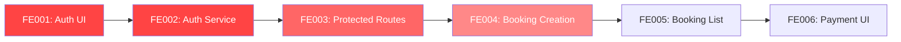
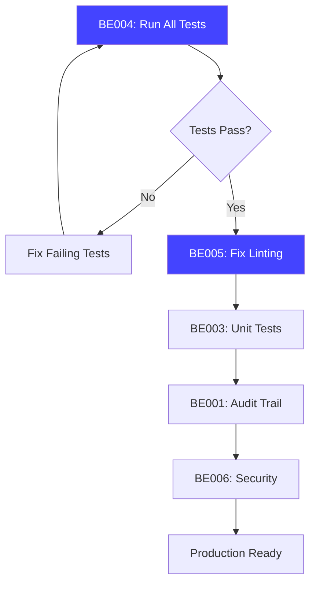

# 📊 Task Priority Matrix - Visual Guide

**Generated**: 2025-10-28  
**Todo List**: ✅ Cleared  
**Focus**: Frontend Development + Backend Quality

---

## 🎯 Priority Overview

```
┌─────────────────────────────────────────────────────────────┐
│                    TASK DISTRIBUTION                         │
├─────────────────────────────────────────────────────────────┤
│  ✅ Completed:     8 tasks   (23%)                          │
│  🔥 P0 Critical:   7 tasks   (20%)                          │
│  ⭐ P1 High:      11 tasks   (31%)                          │
│  📋 P2 Medium:     9 tasks   (26%)                          │
│  📖 Documentation: 8 tasks   (23%)                          │
└─────────────────────────────────────────────────────────────┘
```

---

## 🔥 CRITICAL PATH (Do First!)

### 🎨 Frontend (User-Facing Features)



**Week 1 Focus**:
1. ✅ FE001: Login page with OTP (2 days) **← START HERE**
2. ✅ FE002: Auth service + interceptors (1 day)
3. ✅ FE003: Protected routes (1 day)

**Week 2 Focus**:
4. ✅ FE004: Booking creation flow (3 days)
5. ✅ FE005: Booking list/history (2 days)

---

### 🔧 Backend (Quality & Production Hardening)



**Week 3 Focus**:
1. ✅ BE004: Run test suite (1 day)
2. ✅ BE005: Fix all linting (0.5 days)
3. ✅ BE003: Common services tests (1 day)
4. ✅ BE001: Audit trail table (1 day)
5. ✅ BE006: Security + rate limiting (1 day)

---

## 📋 Detailed Task Breakdown

### 🎨 FRONTEND TASKS (6 Total)

| ID | Priority | Task | Effort | Dependencies |
|----|----------|------|--------|-------------|
| **FE001** | 🔥 P0 | Auth UI (Login + OTP) | 2 days | None |
| **FE002** | 🔥 P0 | Auth Service Layer | 1 day | FE001 |
| **FE003** | ⭐ P1 | Protected Routes | 1 day | FE002 |
| **FE004** | ⭐ P1 | Booking Creation Flow | 3 days | FE003 |
| **FE005** | ⭐ P1 | Booking List/History | 2 days | FE003 |
| **FE006** | 📋 P2 | Payment UI | 2 days | FE004 |

**Total Estimated Effort**: 11 days

---

### 🔧 BACKEND TASKS (6 High Priority)

| ID | Code Review | Priority | Task | Effort |
|----|-------------|----------|------|--------|
| **BE001** | T-019 | 🔥 P0 | Audit Trail Table | 0.5 days |
| **BE002** | T-026 | 📋 P2 | Notification System | 2 days |
| **BE003** | T-012/13/14 | ⭐ P1 | Common Services Tests | 1 day |
| **BE004** | T-030 | 🔥 P0 | Run Test Suite | 0.5 days |
| **BE005** | T-031 | 🔥 P0 | Fix Linting | 0.5 days |
| **BE006** | T-027/28 | ⭐ P1 | Security + Rate Limiting | 1 day |

**Total Estimated Effort**: 5.5 days

---

## 🗺️ 3-Week Roadmap

### **Week 1: Frontend Foundation** 🎨
**Goal**: Users can login and view data

```
Mon-Tue:   FE001 - Auth UI (Login page + OTP screen)
Wed:       FE002 - Auth Service (Token management)
Thu:       FE003 - Protected Routes (Route guards)
Fri:       FE005 - Booking List (Read-only view)

Deliverable: ✅ Working authentication + booking list
```

---

### **Week 2: Core Features** 🎨
**Goal**: Users can create bookings

```
Mon-Wed:   FE004 - Booking Creation (Multi-step form)
Thu-Fri:   FE006 - Payment UI (Payment selection)

Deliverable: ✅ End-to-end booking flow
```

---

### **Week 3: Production Ready** 🔧
**Goal**: Backend hardened for production

```
Mon AM:    BE004 - Run all tests
Mon PM:    BE005 - Fix linting errors
Tue:       BE003 - Unit tests for common services
Wed:       BE001 - Audit trail implementation
Thu:       BE006 - Security logging + rate limiting
Fri:       BE002 - Notification system (optional)

Deliverable: ✅ Production-ready backend
```

---

## 📊 Code Review Tasks (from code-review-tasks.json)

### ✅ Completed (8/35)
- [x] T-001: JSDoc for BookingsService
- [x] T-002: JSDoc for UsersService
- [x] T-003: JSDoc for PaymentsService
- [x] T-004: Implement placeholder methods (confirm/cancel/list/availability)
- [x] T-005: JWT authentication (100% migration - 25 endpoints)
- [x] T-007: JSDoc for AvailabilityService
- [x] T-008: JSDoc for BookingNumberService
- [x] T-017: BookingsService tests (31/31 passing)

### 🔥 Critical (P0) - 7 Tasks
- [ ] **T-012**: Unit tests for ValidationService
- [ ] **T-013**: Unit tests for CacheService
- [ ] **T-014**: Unit tests for ErrorHandlerService
- [ ] **T-019**: State machine audit trail → **BE001**
- [ ] **T-030**: Run full test suite → **BE004**
- [ ] **T-031**: Fix linting errors → **BE005**
- [ ] **T-029**: Integration tests for booking flow

### ⭐ High Priority (P1) - 11 Tasks
- [ ] **T-006**: JSDoc for controller endpoints
- [ ] **T-009**: JSDoc for RedisService
- [ ] **T-010**: JSDoc for common services
- [ ] **T-011**: Check circular dependencies
- [ ] **T-015**: Unit tests for BookingNumberService
- [ ] **T-016**: Unit tests for AvailabilityService
- [ ] **T-018**: Enhance UsersService tests (already fixed)
- [ ] **T-021**: Comments for raw SQL queries
- [ ] **T-024**: Review database indices
- [ ] **T-027**: Security logging → **BE006**
- [ ] **T-028**: Rate limiting → **BE006**

### 📋 Medium Priority (P2) - 9 Tasks
- [ ] **T-022**: API documentation catalog
- [ ] **T-023**: Environment variable docs
- [ ] **T-025**: Automated expiry cleanup job (already done?)
- [ ] **T-026**: Notification system → **BE002**
- [ ] **T-032**: Review DTOs
- [ ] **T-033**: Payment system docs
- [ ] **T-034**: Developer setup guide
- [ ] **T-035**: Architectural decision records
- [ ] **T-020**: Booking confirmation workflow docs

---

## 🎯 Success Criteria

### By End of Week 1
- ✅ Users can login with phone + OTP
- ✅ JWT tokens stored and auto-refreshed
- ✅ Protected routes working
- ✅ Users can view booking list

### By End of Week 2
- ✅ Users can create new bookings
- ✅ Availability checking prevents conflicts
- ✅ Payment method selection works
- ✅ Mobile responsive design

### By End of Week 3
- ✅ 100% test pass rate (unit + integration)
- ✅ Zero linting errors
- ✅ Audit trail captures all state changes
- ✅ Rate limiting prevents abuse
- ✅ Security events logged
- ✅ Notification system operational (optional)

---

## 🚀 Quick Start Commands

### Frontend Development
```bash
cd frontend
npm run dev              # Start dev server (port 3001)
npm run lint:fix         # Fix linting errors
npm run type-check       # Check TypeScript
```

### Backend Testing
```bash
cd backend
npm run test:validate-all   # Run all tests
npm run lint -- --fix       # Fix linting
npm run start:dev           # Start backend (port 3000)
```

---

## 📌 Key Decisions

### Frontend Stack (Confirmed)
- ✅ Next.js 16 with App Router
- ✅ TypeScript 5
- ✅ ShadCN UI + Tailwind CSS
- ✅ TanStack Query for API state
- ✅ React Hook Form + Zod

### Backend Priorities
- 🔥 **Testing First**: Fix all tests before new features
- 🔥 **Code Quality**: Zero linting errors
- ⭐ **Audit Trail**: Required for compliance
- ⭐ **Security**: Logging + rate limiting
- 📋 **Notifications**: Nice-to-have for Week 3

---

## 🎯 Next Action

**START HERE** → **FE001: Implement Auth UI**

1. Create `/frontend/src/app/(auth)/login/page.tsx`
2. Build phone input form with validation
3. Create OTP verification screen
4. Integrate with backend `/auth/request-otp` and `/auth/verify-otp`
5. Store tokens in localStorage
6. Redirect to dashboard

**Estimated Time**: 2 days  
**Complexity**: Medium  
**Impact**: 🔥 Unblocks all other frontend work
